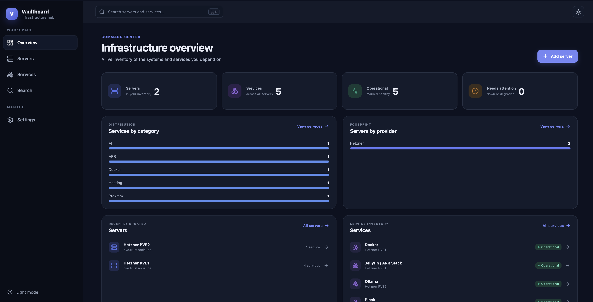

<p align="center">
  
</p>

# Vaultboard

Vaultboard is a private, self-hosted infrastructure dashboard for organizing servers, services, endpoints, tags, categories, and operational notes. It runs as a single container and stores everything in a local SQLite database.

## Highlights

- Server inventory with hostnames, IP addresses, operating systems, providers, locations, notes, and custom tags
- Service inventory with URLs, ports, categories, descriptions, and status tracking
- Dashboard statistics and distribution summaries
- Search and filters across the entire inventory
- Custom tags and service categories
- Secure owner account, password hashing, database-backed sessions, CSRF protection, rate limiting, and per-account data isolation
- Responsive desktop, tablet, and mobile interface with light, dark, and system themes
- Persistent SQLite storage with WAL mode and foreign-key enforcement
- Docker image, health check, non-root runtime, and durable Compose volume

## Quick start with Docker Compose

Requirements: Docker Engine 24+ and Docker Compose v2.

```bash
git clone <your-repository-url> vaultboard
cd vaultboard
docker compose up -d --build
```

Open `http://localhost:3001`. The first visitor can create the owner account. Once that account exists, public registration closes automatically.

The SQLite database is stored in the named Docker volume `vaultboard-data`, so it survives container replacement and image upgrades.

### Stop or update Vaultboard

```bash
docker compose down
git pull
docker compose up -d --build
```

Do not use `docker compose down -v` unless you intentionally want to delete all Vaultboard data.

## Configuration

Docker Compose reads a local `.env` file automatically. Copy the example before changing defaults:

```bash
cp .env.example .env
```

| Variable | Default | Purpose |
| --- | --- | --- |
| `VAULTBOARD_PORT` | `3001` | Host port used by Docker Compose |
| `DATABASE_PATH` | `./data/vaultboard.db` | SQLite file path for local, non-Docker runs |
| `ALLOW_REGISTRATION` | `false` | Allow additional accounts after the first owner exists |
| `TRUST_PROXY` | `false` | Express proxy trust setting; use `1` behind one trusted reverse proxy |
| `NODE_ENV` | `production` | Enables secure cookies and production static serving |
| `PORT` | `3001` | HTTP port for a direct Node.js run |

Never commit `.env`; it is ignored by Git. Vaultboard does not require API keys or external services.

## HTTPS and reverse proxies

Run Vaultboard behind HTTPS for any network beyond a trusted local LAN. When a reverse proxy terminates TLS, set `TRUST_PROXY=1`. Vaultboard automatically marks session cookies as Secure when the request arrives over HTTPS (including trusted forwarded HTTPS requests).

The proxy should forward `Host`, `X-Forwarded-For`, and `X-Forwarded-Proto`. Keep Vaultboard on a private network when possible.

## Backups

SQLite uses WAL mode. The safest online backup is SQLite's backup command from a temporary container attached to the volume:

```bash
docker run --rm -v vaultboard-data:/data -v "$PWD/backups:/backup" alpine:3.22 \
  sh -c "apk add --no-cache sqlite && sqlite3 /data/vaultboard.db '.backup /backup/vaultboard-$(date +%F).db'"
```

Restore only while Vaultboard is stopped, and keep a copy of the current database before replacing it.

## Local development

Requirements: Node.js 22.13+ and pnpm 11+.

```bash
pnpm install
cp .env.example .env
```

For local development, set `NODE_ENV=development` in `.env`, then run:

```bash
pnpm dev
```

The interface is available at `http://localhost:5173`; API requests are proxied to the local server on port 3001.

### Quality checks

```bash
pnpm lint
pnpm test
pnpm build
```

`pnpm check` runs all three in sequence. A production run built outside Docker uses `NODE_ENV=production pnpm start` and serves both the API and compiled interface from port 3001.

## Architecture

- **Frontend:** React, TypeScript, Vite, React Router, TanStack Query, and Lucide icons
- **Backend:** Express with a versionable JSON API, Zod validation, Helmet security headers, cookie-based sessions, and request throttling
- **Storage:** `better-sqlite3` with prepared statements, foreign keys, WAL journaling, ownership checks, and indexed common queries
- **Authentication:** bcrypt password hashes (cost 12); opaque random session tokens are SHA-256 hashed before database storage; HttpOnly, SameSite cookies; per-session CSRF tokens
- **Deployment:** multi-stage Docker build and a single non-root Node.js process

The server automatically creates its schema and indexes at startup. Product records are always scoped to the authenticated account. Tags and categories are seeded with useful defaults when an account is created.

## Operational notes

- Vaultboard tracks the status you assign to a service; it does not actively poll endpoints.
- Password recovery is intentionally not email-based because Vaultboard has no external mail dependency. Back up the database and keep the owner password in a password manager.
- Additional user accounts can be enabled with `ALLOW_REGISTRATION=true`; Vaultboard currently provides account-level isolation rather than shared teams or role-based access.

## License

MIT License
